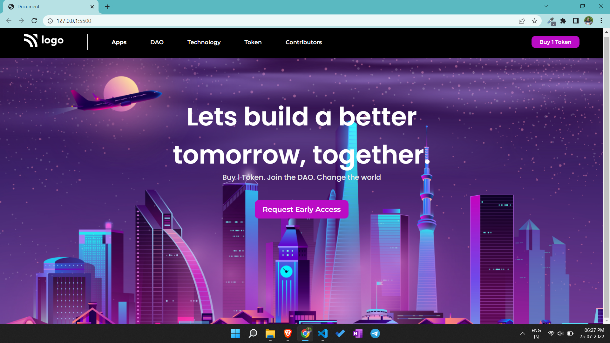

# Portfolio project 5

This is a one page portfolio template project made in HTML and CSS.

# Project live link

[Portfolio-project-5](https://tranquil-bombolone-400b7b.netlify.app)

# Screenshot

# My learnings from this projects

- Learned about giving proper margin and padding to elements.
- Learned to add different fonts from google fonts.
- Learned to design attractive buttons.

# Time to finish the projecet

I took about 2.5 hours approximately to complete this project.
